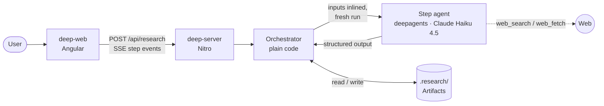
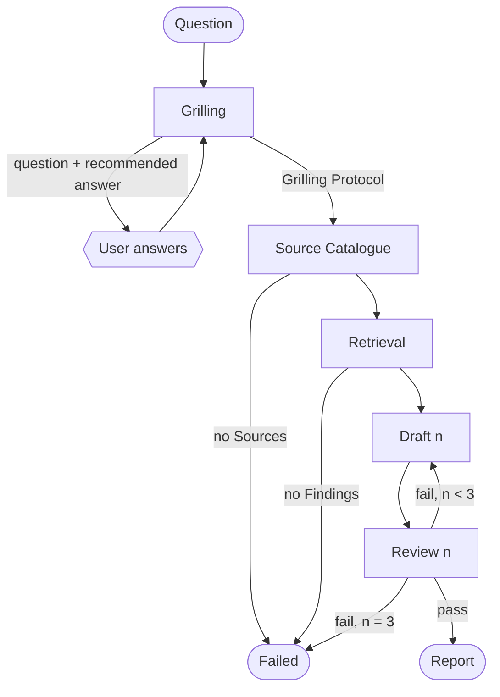

# deep

deep automates research and ensures high-quality output.

- **Grills first**: asks up to 5 questions, pins scope, goal and audience
- **Primary Sources only**: agents may search and read only hosts from the Source Catalogue
- **Every Claim cited**: each Claim points to a Finding `[Fn]` with a verbatim quote and URL
- **Self-checking**: a Review checks every Draft, with up to 3 Rounds
- **Honest**: what can't be backed becomes a Gap, not a guess

Terms (Research, Step, Artifact, Finding, Claim, Round, Gap…) → [Glossary](packages/deep-server/CONTEXT.md)

## Quickstart

```sh
pnpm install
export ANTHROPIC_API_KEY=…   # or DEEP_FAKE_MODEL=true: scripted model, no key
pnpm dev                     # web :4200 → server :3000
pnpm test
```

## Example

See report [Significant strategical decisions at IKEA in last 5 years](./.archive/ikea/ikea_strategiewechsel_2019_2024_report.md)

## Architecture



- Orchestrator = deterministic code, not an agent. Picks next Step from **which Artifacts exist**. No state file.
- Agents never touch files. Orchestrator inlines inputs, validates output against a zod schema, writes the Artifact.
- Each agent gets only its own skill (`src/features/research/skills/<step>/SKILL.md`) plus minimal context → less hallucination.
- Restart → Research is Interrupted → next message resumes from Artifacts.

Why → [ADR-0001: Deterministic Orchestrator](packages/deep-server/docs/adr/0001-deterministic-orchestrator.md)

### Research Steps



Failed / Completed → only a reset (`DELETE /api/research`) starts over.

### Structured outputs & Artifacts

`<topic>` = slug of the Topic, the short phrase or question Grilling gives the Research; the Topic also titles the Report.

| Step             | Agent tools                                    | Structured output                                                       | Artifact                                                       |
| ---------------- | ---------------------------------------------- | ----------------------------------------------------------------------- | -------------------------------------------------------------- |
| Grilling         | –                                              | `question`, `recommendedAnswer` · or `done`, `topic`, `protocol`        | `grilling_transcript.json` → `<topic>_grilling_protocol.md`    |
| Source Catalogue | `web_search`                                   | `sources[]` (hosts)                                                     | `<topic>_source_catalogue.json`                                |
| Retrieval        | `web_search`, `web_fetch`, limited to SC hosts | `findings[]`: `statement`, `url`, `quote`                               | `<topic>_findings.md` (F1…Fn)                                  |
| Draft            | –                                              | `summary`, `keyFacts[]`, `gaps[]`, `followUpQuestions[]`, citing `[Fn]` | `<topic>_draft_<n>.md`                                         |
| Review           | –                                              | `verdict` (pass/fail), `offendingClaims[]`                              | `<topic>_review_<n>.md` (verdict in front matter)              |
| _code_           | –                                              | –                                                                       | `<topic>_report.md`: passing Draft + Sources of cited Findings |

Enforced by code, not prompts:

- ≤ 5 Grilling questions, then forced to conclude
- Hosts normalised (wildcards, trailing dots, punycode, no IPs)
- Findings from hosts outside the SC are dropped
- ≤ 3 Rounds; from Round 2 the Draft agent also sees the previous Draft + its failing Review
- Each Step gets 2 attempts (errors, schema-invalid output), then the Research is Interrupted
- Report built by code: Topic + As of header from the GP, body from the Draft, Sources section from the cited Findings → Review judges content only
- Every agent is told today's date; the Research's time frame counts from its As of date (the day it started), recorded in the Grilling Protocol

## Testing

| Layer  | Kind        | What                                                                                                                          |
| ------ | ----------- | ----------------------------------------------------------------------------------------------------------------------------- |
| server | integration | `createResearch()` end-to-end: real deepagents wiring, skills, filesystem. **Only the LLM is scripted** (`ScriptedChatModel`) |
| server | unit        | Paths, model choice, agent client                                                                                             |
| web    | component   | Home page via TestBed, fake HTTP + SSE stream                                                                                 |

Planned: evals against the real model to test the LLM harness.

## What's next

- [ ] Backlog Backlog
- [ ] AFK
- [ ] RAG with company knowledge
- [ ] (Forced) human review
- [ ] Create slides (PowerPoint) from results
- [ ] Source catalogue override
- [ ] Make grilling session skippable
- [ ] Sandbox
- [ ] Context control (stay in smart zone)
- [ ] Report templates (with different sections)
- [ ] Different models for each step
- [ ] When report is created, user can edit it in-place
- [ ] Export PDF, MS Word
- [ ] QA after report
